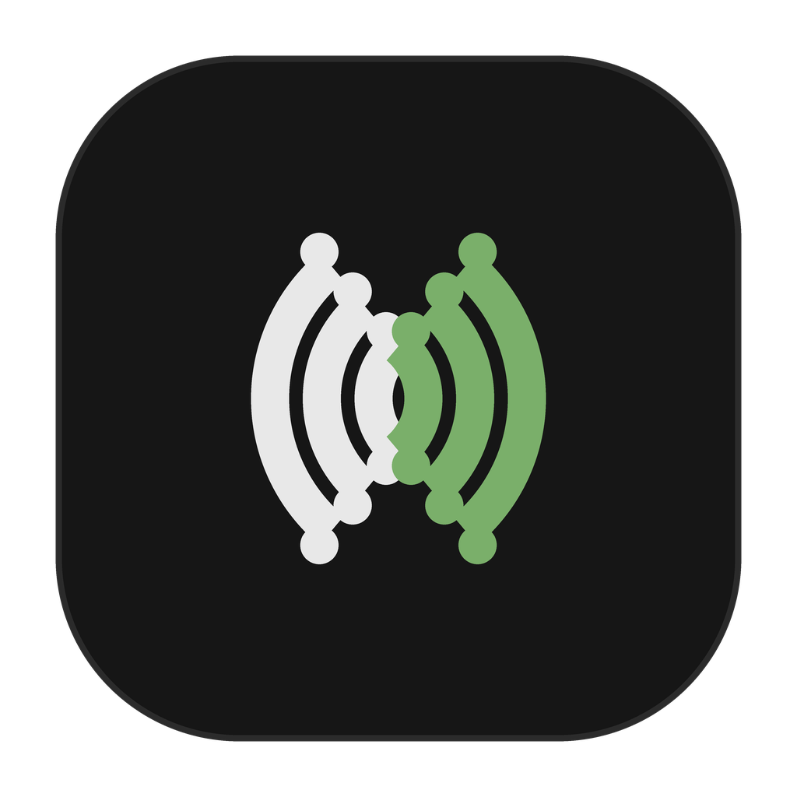

<div align="center">



# Ahenk

**PC'de çalan sesi anlık çeviren canlı çeviri uygulaması**

Sistem sesi · Mikrofon · Tek uygulama sesi → **metin + sesli çeviri**

**[Türkçe](#ahenk)** · [English](README.en.md)

[](meta.py)
[](https://www.python.org/downloads/)
[](#gereksinimler)
[](LICENSE)
[](tests/)

</div>

> **Kısaca:** Ahenk, seçili ses kaynağını dinler, [Gemini Live Translate](https://ai.google.dev/) oturumuna gönderir ve çeviriyi hem **yazılı transkript** hem de **sesli anlatım** olarak verir. Film, toplantı, ders veya yayın — yabancı dil, hoparlörünüzden Türkçe (veya seçtiğiniz dil) olarak çıkar.

---

## İçindekiler

- [Öne çıkanlar](#öne-çıkanlar)
- [Özellikler](#özellikler)
- [Nasıl çalışır](#nasıl-çalışır)
- [Teknoloji kartı](#teknoloji-kartı)
- [Gereksinimler](#gereksinimler)
- [Kurulum](#kurulum)
- [Masaüstü arayüzü](#masaüstü-arayüzü)
- [Konsol (CLI)](#konsol-cli)
- [Diller](#diller)
- [API anahtarı](#api-anahtarı)
- [Yerel ayarlar ve dosyalar](#yerel-ayarlar-ve-dosyalar)
- [Gizlilik ve güvenlik](#gizlilik-ve-güvenlik)
- [Proje yapısı](#proje-yapısı)
- [Tek dosyalık derleme](#tek-dosyalık-derleme)
- [Otomatik güncelleme](#otomatik-güncelleme)
- [Test](#test)
- [Sorun giderme](#sorun-giderme)
- [Lisans](#lisans)

---

## ✨ Öne çıkanlar

| | |
|---|---|
| 🎧 **3 giriş kaynağı** | Sistem sesi (WASAPI loopback), mikrofon veya tek bir masaüstü uygulamasının sesi (işlem ağacı yakalama) |
| 🔄 **Kesintisiz hot-swap** | Çalışan çeviri oturumunu öldürmeden giriş/çıkış aygıtını değiştirme |
| 📺 **Altyazı overlay'i** | Her zaman üstte, sürüklenebilir, tıklama-geçirgen yapılabilen canlı altyazı penceresi |
| ⌨️ **Genel kısayollar** | Uygulama arka plandayken çeviri sesini açıp kapatma ve çeviriyi başlatıp durdurma; Ayarlar'dan atanabilir |
| 🌗 **Çift tema + çift arayüz dili** | Koyu / açık tema; Türkçe / İngilizce arayüz |
| 📝 **Dışa aktarma** | Transkriptleri **TXT**, **SRT** (altyazı) ve **JSONL** olarak kaydetme + oturum geçmişi (`history.jsonl`) |
| 🔇 **Yankı koruması** | Aynı hoparlör kullanılıyorsa çeviri çalarken girişe eş süreli sessizlik enjekte edilir, akış kopmaz |
| 🔁 **Akıllı yeniden bağlanma** | Geçici ağ hatalarında en fazla 3 deneme; kalıcı hatalarda (anahtar/kota) gereksiz deneme yok |
| 📦 **Tek dosya dağıtım** | Kurulumsuz `Ahenk.exe` + konsol sürümü `Ahenk-cli.exe`; SHA-256 doğrulamalı otomatik güncelleme |

---

## 🚀 Özellikler

### Ses yakalama ve oynatma

- **Sistem sesi (loopback):** varsayılan hoparlörün `[Sistem]` kaydı üzerinden PC'de çalan her şey
- **Mikrofon:** `[Mikrofon]` girişleri, konuşma çevirisi için
- **Tek uygulama:** listedeki **Masaüstü uygulaması seç…** ile yalnızca o program + alt işlemleri (örn. Chrome'da tüm sekmeler). Windows build 20348+ gerekir
- **Çıkış:** hoparlör seçimi veya **Hiçbiri** (yalnızca metin modu)
- **Canlı VU metre:** oturum kapalıyken bile seçili girişi gösteren bağımsız önizleme izleyicisi
- **Ses kontrolleri:** çıkış kazancı (`--volume 0.0–2.0`), sessizlik kapısı (`--vad`, örn. `0.01`)

### Çeviri deneyimi

- **Kaynak dil:** `Otomatik` (model algılar) veya sabit BCP-47 kodu
- **Hedef dil:** 20 dil (tablo aşağıda)
- **İki panel:** **Duyulan** (kaynak transkript) ve **Çeviri** (hedef transkript + ses)
- Panel başına **Kopyala**, **Temizle**, **Dışa Aktar**
- Dil okuna tıklayınca kaynak ↔ hedef takası (kaynak Otomatik iken kapalı)
- Gecikme ölçümü: ilk çeviri parçasında konuşma→çeviri süresi (ms) raporlanır

### Arayüz ve konfor

- 960×580 koyu/açık temalı pencere: sol kontrol rayı + iki transkript paneli + alt durum şeridi
- Durum noktası: Hazır / Bağlanıyor / Çalışıyor / Durdu
- **Altyazı penceresi:** son çeviri satırı, yazı tipi boyutu + opaklık ayarı, tıklama-geçirgen mod
- Türkçe / İngilizce arayüz dili, pencere ve overlay konumu hatırlanır
- Aygıt listesini **Yenile**, bağlantı ve aygıt hatalarında Türkçe yönlendirmeli mesajlar
- Oturum geçmişi (`history.jsonl`, 2 MB'ta otomatik devir) ve dönen dosya günlüğü (`logs/ahenk.log`)

---

## ⚙️ Nasıl çalışır

```
Giriş aygıtı ── 48 kHz stereo, 20 ms bloklar ──► mono + 16 kHz PCM16
                                                        │
                                                        ▼
                                         Gemini Live (v1beta)
                              models/gemini-3.5-live-translate-preview
                                                        │
                    ┌───────────────────┴───────────────────┐
                    ▼                                       ▼
        Hoparlör (24 kHz PCM16, ~80 ms           Duyulan / Çeviri panelleri
        ön tampon + 8 ms kosinüs fade)           (delta + kümülatif birleştirme)
```

- **Yakalama tek daemon thread'dedir:** `soundcard` COM nesneleri thread'ler arası paylaşılamaz; hot-swap kararları ses thread'inin içinde uygulanır.
- **Kuyruklar geride kalmayı yutar:** gönderim kuyruğu (50) ve oynatma kuyruğu (200) dolunca en eski parçayı düşürür. Cümle bitiminde oynatma kuyruğu **temizlenmez** (yoksa ses kesik kesik olur).
- **Transkript birleştirme:** model parça parça hem delta hem kümülatif gönderebilir; `merge_transcript` ikisini de doğru birleştirir.
- **Yankı koruması:** giriş ve çıkış aynı uçtaysa, duyulabilir çeviri çalarken giriş yerine aynı süreli sessizlik gönderilir; bağlantının ses akışı kesilmez. Sessiz çıkış paketleri bu korumayı uzatmaz.
- **Dayanıklılık:** yakalama/oynatma heartbeat ile izlenir; kopan aygıt oturumu öldürmeden yeniden denenir. Aygıt Stall başına tek satır uyarı verilir.

---

## 🧰 Teknoloji kartı

| Katman | Kullanılan teknoloji | Açıklama |
|---|---|---|
| 🐍 **Dil** | Python 3.11+ (`asyncio.TaskGroup`) | Eşzamanlı yakala / gönder / al / çal hattı |
| 🖥️ **Arayüz** | `tkinter` (standart kütüphane) | Ana pencere, altyazı overlay'i, uygulama seçici, ayarlar |
| 🔊 **Ses G/Ç** | `soundcard` ≥ 0.4.3 (WASAPI) | Loopback + mikrofon + hoparlör listeleme ve akış |
| ➗ **Sinyal işleme** | `numpy` ≥ 1.26, < 3.0 | 48 kHz → 16 kHz FIR + lineer resample, RMS/VU, 24 kHz PCM16 ↔ float, kosinüs fade |
| 🤖 **Çeviri motoru** | `google-genai` ≥ 2.0, < 3.0 (`v1beta` Live API) | Canlı ses + çift transkript akışı, sözlük/terim desteği (`SystemAudioLoop(glossary=…)`) |
| 🔑 **Yapılandırma** | `python-dotenv` ≥ 1.0 | `.env` / ortam değişkeni → `GEMINI_API_KEY` okuma |
| 🧪 **Test** | `pytest` ≥ 8 | Ağsız sahte oturum testleri (Windows CI'da 3.11 + 3.12) |
| 📦 **Dağıtım** | `pyinstaller` ≥ 6.10 + `Ahenk.spec` | Onefile `Ahenk.exe` (penceresiz) + `Ahenk-cli.exe` (konsol), SHA-256 yan dosyası |
| 🔄 **Güncelleme** | Standart kütüphane (`urllib`) | GitHub Releases denetimi, boyut + SHA-256 doğrulama, atomik exe değişimi + geri alma |

> Sürümler `requirements.txt` / `requirements-dev.txt` içinde sabit aralıklardadır. Model adı `GEMINI_LIVE_MODEL` ortam değişkeni veya `--model` bayrağı ile ezilebilir (varsayılan: `models/gemini-3.5-live-translate-preview`).

---

## 💻 Gereksinimler

| | |
|---|---|
| **İşletim sistemi** | Windows 10/11 (loopback ve tek-uygulama yakalama için). Mikrofon yolu Linux/macOS'ta da denenebilir |
| **Python** | 3.11 veya üzeri ([python.org](https://www.python.org/downloads/) — kurulumda PATH işaretli olsun) |
| **Ağ** | Gemini API erişimi |
| **API anahtarı** | Ücretsiz [Google AI Studio anahtarı](https://aistudio.google.com/apikey) |
| **Ses** | WASAPI uyumlu hoparlör (çoğu PC'de varsayılan aygıtın `[Sistem]` kaydı) |

---

## 📥 Kurulum

En kısa yol — sanal ortam, bağımlılıklar ve menü tek komutta:

```bat
ahenk.bat
```

| Seçim | İşlem |
|---|---|
| `1` | Arayüzü çalıştır (`main.py`) |
| `2` | Konsolu çalıştır (`cli.py`) |
| `3` | Tek dosyalık derle (`build.bat` → `dist\Ahenk.exe`) |
| `4` | Bağımlılıkları yenile |
| `5` | Çıkış |

Elle kurulum:

```bat
py -3 -m venv .venv
.venv\Scripts\pip install -r requirements.txt
.venv\Scripts\python main.py
```

Linux / macOS (mikrofon; loopback garanti değil):

```sh
python3 -m venv .venv
.venv/bin/pip install -r requirements.txt
.venv/bin/python main.py
```

> Tkinter resmi Windows Python kurulumuyla birlikte gelir; ayrıca kurmanıza gerek yok.

---

## 🖥️ Masaüstü arayüzü

`python main.py` — 960×580 pencere, sol kontrol rayı + iki transkript paneli.

**Sol ray:**

1. Başlık, sürüm rozeti, **Altyazı** düğmesi, hakkında (`ⓘ`), tema düğmesi
2. Durum noktası + canlı VU metre
3. **Giriş / Çıkış** — `[Sistem]` loopback, `[Mikrofon]` veya **Masaüstü uygulaması seç…**; çıkışta **Hiçbiri** = yalnızca metin
4. **Dil** — kaynak (Otomatik + 20 dil) → hedef; ok düğmesi takas eder
5. **API anahtarı** — `•` ile maskeli; **Kaydet** (doğrulamalı **Test** düğmesiyle) veya Başlat sırasında yazılır
6. **Başlat / Durdur** — çalışırken aygıt, dil ve anahtar alanları kilitlenir; aygıt değişimi hot-swap ile oturuma yansır
7. **Ayarlar → Genel Kısayollar** — çeviri sesini aç/kapat ve çeviriyi başlat/durdur tuşlarını yakalayıp Windows genelinde kaydeder

**Paneller:** Duyulan | Çeviri — her birinde Kopyala / Temizle / Dışa Aktar (TXT, SRT, JSONL). Alt şerit `[bilgi]` / `[uyarı]` / `[hata]` loglarını gösterir.

**Altyazı penceresi:** küçük, her zaman üstte ve sürüklenebilir; fare üzerine gelince yazı boyutu, tıklama-geçirgenlik, kapatma ve sağ alt boyutlandırma araçları görünür. Yüksekliğine sığan son altyazı satırlarını gösterir; opaklığı ayarlanabilir.

**Tek uygulama sesi:** hedef programı önce açın → giriş listesinden **Masaüstü uygulaması seç…** → küçük pencereden programı seçin. Yalnızca o işlem ağacı dinlenir (Chrome'da aynı ağaçtaki tüm sekmeler dahildir). Uygulama kapanır/yeniden başlarsa sessizce sistem sesine dönülmez; yeniden seçmeniz istenir. Görünür penceresi olmayan arka plan işlemleri listelenmez.

> **İpucu — yankı önleme:** Sistem sesini dinlerken çeviri çıkışını kulaklık gibi farklı bir aygıta verin veya **Hiçbiri** (yalnızca metin) seçin. Aynı hoparlörde Ahenk, çeviri çalarken girişi sessizlikle doldurur; bu sırada çakışan kaynak konuşma da bastırılır. Kesintisiz kaynak yakalama için ayrı çıkış kullanın.

---

## ⌨️ Konsol (CLI)

```bat
.venv\Scripts\python cli.py --help
.venv\Scripts\python cli.py --list-devices
.venv\Scripts\python cli.py --dst tr
.venv\Scripts\python cli.py --mic --src en --dst tr
.venv\Scripts\python cli.py --device Kulaklik --src auto --dst de
```

| Bayrak | Varsayılan | Açıklama |
|---|---|---|
| `--src` | `auto` | Kaynak BCP-47 kodu veya `auto` |
| `--dst` | `tr` | Hedef BCP-47 kodu |
| `--device` | yok | Giriş/loopback aygıt adı filtresi (alt dize) |
| `--output` | yok | Çıkış hoparlör adı filtresi (alt dize) |
| `--mic` | kapalı | Sistem sesi yerine mikrofon yakala |
| `--text-only` | kapalı | Hoparlör çıkışı olmadan yalnızca metin |
| `--no-interactive` | kapalı | Konsoldan metin okumadan yalnız Ctrl+C ile çalış |
| `--list-devices` | — | Hoparlör / loopback / mikrofon listele, çık |
| `--list-langs` | — | Desteklenen dilleri ve kodlarını listele, çık |
| `--version` | — | Sürümü yazdır, çık |
| `--json` | kapalı | Betikleme için satır satır JSON akışı (JSONL) |
| `--log` | yok | Tüm konsol çıktısını dosyaya kaydet |
| `--vad` | `0.0` | RMS sessizlik kapısı eşiği (örn. `0.01`); eşik altı ses sessizlikle doldurulur, paket akışı korunur |
| `--volume` | `1.0` | Çeviri sesi kazancı (`0.0`–`2.0`) |
| `--model` | varsayılan | Gemini Live model adı |
| `--api-key` | yok | Kabuk geçmişine düşer; `.env` veya arayüzü tercih edin |

Durdurmak için `q` + Enter veya Ctrl+C (`--no-interactive` modunda doğrudan Ctrl+C). `--json` modunda `heard / trans / latency / detected_src / log` türlerinde satırlar üretilir.

---

## 🌍 Diller

Kaynak: **Otomatik + 20 dil**. Hedef: **20 dil** (`languages.py` — yeni dil görünen ad → BCP-47 olarak eklenir).

| Arayüz adı | Kod | Arayüz adı | Kod |
|---|---|---|---|
| İngilizce | `en` | Felemenkçe | `nl` |
| Türkçe | `tr` | Japonca | `ja` |
| Almanca | `de` | Çince (Basitleştirilmiş) | `zh-CN` |
| Fransızca | `fr` | Çince (Geleneksel) | `zh-TW` |
| İspanyolca | `es` | Korece | `ko` |
| İtalyanca | `it` | Hintçe | `hi` |
| Portekizce | `pt` | Lehçe | `pl` |
| Rusça | `ru` | Ukraynaca | `uk` |
| Arapça | `ar` | Endonezce | `id` |
| _(kaynakta ek)_ Otomatik | `auto` | Vietnamca / İsveççe | `vi` / `sv` |

Kaynak **Otomatik** iken `language_codes` boş bırakılır, dili model algılar; hedefte Otomatik yoktur. Arapça hedefte sağdan-sola (RTL) metin yönü desteklenir.

---

## 🔑 API anahtarı

Depoda anahtar yoktur. [AI Studio](https://aistudio.google.com/apikey) üzerinden ücretsiz oluşturun.

Öncelik sırası (`config.resolve_api_key`):

1. CLI `--api-key` (kabuk geçmişine yazar — kaçının)
2. `GEMINI_API_KEY` — ortam değişkeni veya proje kökündeki `.env` (`python-dotenv`)
3. Kayıtlı `config.json` → `api_key` (arayüzde Kaydet / Başlat, arayüzdeki **Test** düğmesi anahtarı gerçek Live modeline karşı doğrular)

`.env` örneği — **commit etmeyin** (`.gitignore` içinde):

```
GEMINI_API_KEY=buraya-anahtariniz
```

> Sızan anahtarı AI Studio'dan iptal edin. Ekran görüntüsü, issue, PR veya `--api-key` ile paylaşmayın. Testlerdeki `sk-test` / `sk-live-1` değerleri sahtedir.

---

## 📁 Yerel ayarlar ve dosyalar

Git'e düşmez. Testlerde `VOICE_TRANSLATE_CONFIG` (veya `AHENK_CONFIG`) ile yol değiştirilebilir.

| İşletim sistemi | Yapılandırma dosyası |
|---|---|
| Windows | `%APPDATA%\Ahenk\config.json` |
| Linux / macOS | `$XDG_CONFIG_HOME/Ahenk/config.json` veya `~/.config/Ahenk/config.json` |

Aynı klasörde: `logs/ahenk.log` (dönen günlük, 1 MB × 2 yedek) ve `history.jsonl` (oturum geçmişi, 2 MB'ta devir).

| Konu | Davranış |
|---|---|
| 🔒 **Anahtar saklama** | Windows'ta DPAPI (`CryptProtectData`, kullanıcı oturumuna bağlı) ile şifreli; Unix'te dosya `0600` izinli |
| 🧾 **Saklanan alanlar** | `api_key`, `input_device`, `input_application`, `output_device`, `src_lang`, `dst_lang`, `theme`, `ui_lang`, pencere/overlay geometrisi, overlay görünümü, `save_history` |
| 🛡️ **Bozuk dosya** | JSON bozulursa `.json.bak` alınır ve kurtarılabilen alanlar geri yüklenir; bilinmeyen alanlar korunur |

---

## 🔐 Gizlilik ve güvenlik

- Yakalanan ses ve üretilen çeviri Google'a gönderilir. Model: `models/gemini-3.5-live-translate-preview`. Ücret ve kota [Gemini API](https://ai.google.dev/) şartlarına bağlıdır.
- Anahtar ve tercihler yalnızca bu makinedeki `config.json`'da durur.
- Depoda gerçek anahtar, `.env` veya `config.json` yoktur. Yok sayılanlar: `.env`, `.env.*`, `config.json`, `.venv/`, `dist/`, `build/`, `*.spec`, `*.exe`.
- Git geçmişi taranmıştır; gerçek anahtar yoktur. Commit e-postası GitHub noreply'dir.

> Bu uygulama sesinizi üçüncü taraf bir API'ye gönderir. Hassas içerikte kullanmadan önce bunu kabul edin.

---

## 🗂️ Proje yapısı

```
main.py            masaüstü giriş noktası (güncelleme yardımcısı + Tk döngüsü)
cli.py             konsol arayüzü (argümanlar, JSONL akışı, log dosyası)
ahenk.bat          venv + menü + derleme başlatıcısı
build.bat          PyInstaller onefile derleme betiği
config.py          ayar dosyası, DPAPI şifreleme, anahtar önceliği
loop.py            Gemini oturumu: yakala → gönder → al → çal (+ hot-swap, yankı koruması, VAD)
audio.py           48k→16k resample, PCM16 ↔ float, kosinüs fade
devices.py         soundcard listesi, loopback/hoparlör/mikrofon seçimi
applications.py    görünür masaüstü uygulamaları, güvenli işlem kimliği
process_audio.py   Windows uygulama işlem-ağacı ses yakalama
languages.py       arayüz adı → BCP-47, RTL desteği
i18n.py            arayüz yerelleştirme (tr/en)
export.py          transkript dışa aktarma (TXT, SRT, JSONL)
logger.py          dosya günlüğü + oturum geçmişi
meta.py            sürüm, başlık, yazar
updater.py         GitHub Release denetimi, SHA-256 doğrulama, atomik exe değişimi
gui/app.py         ana pencere, overlay, yeniden bağlanma, hot-swap
gui/theme.py       koyu/açık palet, simge, AppUserModelID
gui/widgets.py     özel Select / düğme bileşenleri
assets/            ahenk.ico, ahenk.png
tests/             pytest (ağ yok; aygıt testi atlanabilir)
```

---

## 📦 Tek dosyalık derleme

`ahenk.bat` → `3`, veya doğrudan:

```bat
.venv\Scripts\python -m pip install pyinstaller
.venv\Scripts\python -m PyInstaller --noconfirm --clean Ahenk.spec
```

Çıktılar: `dist\Ahenk.exe` (arayüz), `dist\Ahenk.exe.sha256` ve `dist\Ahenk-cli.exe` (konsol). `dist/`, `build/` ve `*.exe` git'te yoktur. Exe, Gemini anahtarınızı sizden ister; anahtar gömülü değildir.

---

## 🔄 Otomatik güncelleme

Yalnızca Windows onefile `Ahenk.exe` dağıtımında etkindir. Uygulama açılışta son kararlı GitHub Release'i denetler; **Hakkında → Güncellemeleri denetle** ile elle de bakılabilir. Yeni sürüm onaylanınca:

1. Yalnız `TheRaven815/voice_translate` deposundaki `Ahenk.exe` indirilir (izin verilen GitHub host'ları + URL şeması denetimiyle).
2. Dosya boyutu ve GitHub asset digest'i veya `Ahenk.exe.sha256` içindeki SHA-256 doğrulanır.
3. Çalışan uygulama kapatılır, exe aynı dizinde atomik olarak değiştirilir ve yeni sürüm başlatılır.
4. Yeni sürümün açılışı doğrulanamazsa önceki exe otomatik geri yüklenir.

İstemciler GitHub API'ye anahtarsız eriştiği için depo **public** olmalıdır. Yayın için `meta.py`, `pyproject.toml` ve `version_info.txt` sürümlerini eşitleyip `vMAJOR.MINOR.PATCH` etiketi gönderin:

```bat
git tag v0.6.5
git push origin v0.6.5
```

`.github/workflows/release.yml` testleri çalıştırır, onefile exe'yi derler, SHA-256 dosyasını üretir ve ikisini GitHub Release'e yükler. Taslak ve ön sürümler istemcilere sunulmaz.

> SHA-256 aktarım bozulmasını ve yanlış dosyayı engeller; kod imza sertifikası sağlandığında Windows Authenticode imzası ayrıca eklenmelidir.

---

## 🧪 Test

Ağ çağrısı yok — istemci taklit edilir.

```bat
.venv\Scripts\python -m pytest
```

| Dosya | Kapsam |
|---|---|
| `tests/test_config.py` | Kayıt, anahtar önceliği, bozuk JSON kurtarma |
| `tests/test_gui.py` | Başlat, paneller, overlay, tercihler |
| `tests/test_cli.py` | Konsol bayrakları ve akışları |
| `tests/test_logger_i18n.py` | Günlük, geçmiş, yerelleştirme |
| `tests/test_updater.py` | Sürüm seçimi, SHA-256, atomik değişim, geri alma |
| `tests/test_live_translate.py` | Resample, transkript birleştirme, sahte oturum |

`test_duplex_with_real_devices_stays_alive` gerçek ses aygıtı ister; yoksa atlanır (`-m "not device"` ile CI'da atlanır).

---

## 🛠️ Sorun giderme

| Belirti | Çözüm |
|---|---|
| `GEMINI_API_KEY bulunamadı` | AI Studio'dan anahtar alın; `.env`, ortam değişkeni veya arayüzde Kaydet / Test |
| `Loopback cihaz bulunamadı` | Windows hoparlör aygıtını denetleyin; listeyi **Yenile**; başka çıkış deneyin |
| Uygulama seçim penceresi boş | Programı açın, penceredeki **Yenile** düğmesine basın; görünür penceresi ve masaüstü işlemi olmalı |
| Seçili uygulama kapandı | Programı yeniden açın, **Masaüstü uygulaması seç…** üzerinden yeniden seçin |
| Ses kesik / gecikmeli | Çıkışı **Hiçbiri** yapıp metni izleyin; ağı ve API kotasını denetleyin |
| Çeviri yok, Duyulan var | Hedef dili ve model erişimini (`gemini-3.5-live-translate-preview`) denetleyin |
| Mikrofon açılmıyor (`AssertionError`) | Windows Ses → Kayıt → Mikrofon → Özellikler → Gelişmiş → Varsayılan Biçimi **48000 Hz** yapın |
| Kısa kesinti uyarısı | Kablosuz aygıtlarda yaygındır, akış sürer; sürerse aygıtı/sürücüyü gözden geçirin |
| Python bulunamadı | [python.org](https://www.python.org/downloads/) — kurulumda PATH seçeneği |
| Tk penceresi açılmıyor | `python main.py` — tkinter resmi Windows kurulumuyla gelir |
| Derleme hatası | `ahenk.bat` → `4` sonra `3`; antivirüsün `dist\` klasörünü kilitlemediğinden emin olun |

---

## 📄 Lisans

Bu proje [MIT Lisansı](LICENSE) ile lisanslanmıştır.

<div align="center">

**Ahenk 0.6.5** · Enes Eliağır · [Sorun bildir](https://github.com/TheRaven815/voice_translate/issues) · [Sürümler](https://github.com/TheRaven815/voice_translate/releases)

</div>
